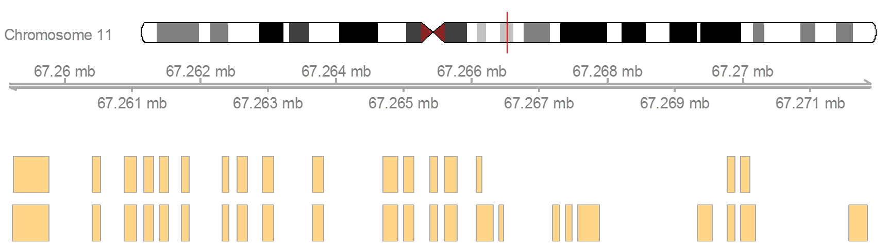
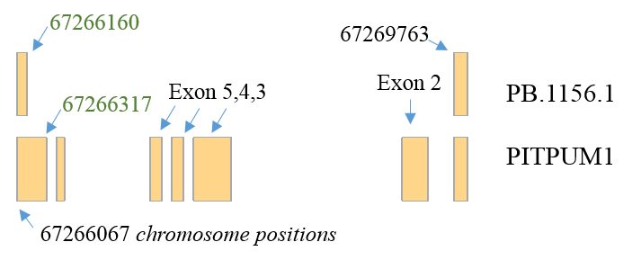
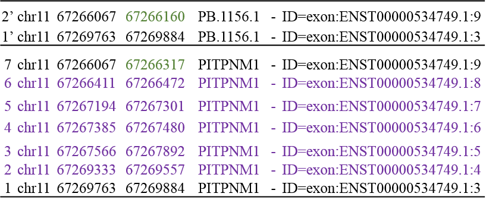

<!--
%% \VignetteEngine{knitr::rmarkdown}
%\VignetteIndexEntry{neoantigeR}
-->

<style type="text/css">

body{ /* Normal  */
      font-size: 14px;
  }
td {  /* Table  */
  font-size: 14px;
}
h1.title {
  font-size: 38px;
  color: DarkRed;
}
h1 { /* Header 1 */
  font-size: 28px;
  color: DarkBlue;
}
h2 { /* Header 2 */
    font-size: 22px;
  color: DarkBlue;
}
h3 { /* Header 3 */
  font-size: 18px;
  font-family: "Times New Roman", Times, serif;
  color: DarkBlue;
}
code.r{ /* Code block */
    font-size: 14px;
}
pre { /* Code block - determines code spacing between lines */
    font-size: 14px;
}
</style>


# A short introduction to neoantigeR

## Purpose of this document

This document is a collection of HOWTOs. Each HOWTO is a short section that demonstrates how to use the containers and operations implemented in the neoantigenR package.

## Authors and Affliations

Shaojun Tang, Ph.D, Innovation Center for Biomedical Informatics, Georgetown University Medical Center, Washington, DC, United States of America,

## Background

It has been reported that greater than 90% of human genes are alternative spliced, suggesting a challenging complexity of the transcriptome reconstruction. An analysis of splicing complexity by gene size has indicated that the combination potential for exon splicing can increase exponentially. Current studies showed that the number of transcripts reported to date may be limited by the short-read sequencing due to the transcript reconstruction algorithms, whereas long-read sequencing is able to significantly improve the detection of alternative splicing variants since there is no need to assemble transcripts from short reads. 

## Introduction

Our neoantigen prediction pipeline requires a very widely used standard data input from next-generation sequencing assays. In the simplest nontrivial scenario, the pipeline only needs a gene prediction output file in GFF format. Our pipeline will use the input GFF file to extract ORFs from the predicted isoforms and compared them with reference protein database typically from Uniprot Swiss-Prot. If the sequencing data is from third-generation long read sequencing, the input files may consist the gene prediction file in GFF format, and a sequence file. 


# Flowchat of the implementation of neoantigeR

neoantigeR is very usefriendly. Users only need to provide a 'Tab' delimited input data file and give the indexes of control and case samples.

As described above, neoantigenR relies on input generated from the analysis of high-throughput parallel sequencing data including short-read RNA-Seq or long-read PacBio SMRT sequencing data. Generally, these data can be easily obtained from existing aligning and gene calling tools. Here, we outline an example preparatory steps to generate these input data.

Reference genome sequence alignment was performed using the Bowtie2 for aligning of original raw sequences (FASTQ files) to obtain SAM/BAM files. In brief, Bowtie (version 2.1) was used for alignment with default parameters. The resulting alignments (in BAM format) file was subsequently used as input to the gene calling tool Cufflinks in de-novo gene-finding mode (no gene annotation is provided) with default parameters. Cufflinks accepted aligned RNA-Seq reads (SAM/BAM format) and assembled the alignments into a parsimonious set of transcripts. A transcript annotation file in GFF format was produced. 


# Running neoantigenR

## provide the input files and setup the enviornment


```{r include=FALSE, cache=FALSE}
	source("../R/neoantigenR.R")
	source("../R/alignment.R")
	source("../R/conf.R")
	source("../R/antigenUtil.R")
  load("../inst/extdata/example.RData")
  library(knitr)
```

To identify differential spliced isoforms or gene with mutations, users need to upload a few files (The users could change the absolute path for these variables, or write these in the confiration file conf.R): including

* a protein annotation file (i.e. user could download the uniprot proteins)
* a reference gene annotation (i.e. user could download the gencode human reference genes)
* a predicted gene model file (such as the gff gene prediction from cufflinks)
* a merged file of predicted and referene genes (by bedtools - intersect from the above two file)


```{r results='hide', message=FALSE, warning=FALSE}

	protein.database.file.name		   =	"../inst/extdata/swissuniprots.fasta"
	reference.gff.file						   =	"../inst/extdata/gencode.v19.annotation.gff3"
	pacbio.gff							         =	"../inst/extdata/model.gff"
	pacbio.gencode.overlapping.file	 =	"../inst/extdata/bedtool.intersect.overlaps.txt"
	output.folder					         	 =	"../inst/extdata/"

```

In the simplest scenario, the user should only need to provide a gtf/gff file containing the predicted genes (from tools such as cufflinks), and another file containing the gtf/gff file intersecting with an existing gene annotation (such as gencode annotation) using Bedtools - Intersect. The uniprot protein sequence file (fasta file) and gencode human reference genes (v19) (gff file) are standard and could be easily downloaded or obtained from other packages.

## neoantigeR analysis with long or short read sequencing data

A dataset containing the full-length whole transcriptome from three diverse human tissues (brain, heart, and liver) was directly downloaded from the PacBio official website and was used in this study. This dataset is ideal for exploring differential alternative splicing events and identification of putative neoantigens.

## step-1. initialize the runtime environment after provindg relevant files

```{r results='hide', message=FALSE, warning=FALSE}

	neoantigenR.initialize()

```

After initialization, users will be able to see the information of the two mandatory files (the gff predicted genes & the merged file by Bedtools).


```{r warning=FALSE}
  kable(head(predicted.genes), caption = "predicted GTF gene models")
  print(head(bedtools.merged.gene.annotations))
```

## step-2. identify differentially spliced gene isoforms and transcripts based on given reference gene annotations

In order to obtain differential spliced isoform for neoantigen prediction, we will visualize the gene model and compare to standard gene annotations

```{r results='hide', message=FALSE, warning=FALSE}

	neoantigenR.get.Model()

```


This gene is on the '-' strand. As we can see, there is an exon skipping and alternative 3' event occuring from exon 2 to exon 7. 

The coordinates of these exons are clearly labeled below.



## step-3. identify putative neoantige peptide sequences from alternatively spliced transcripts by sequence alignment and a scoring system.


```{r results='hide', message=FALSE, warning=FALSE}

	neoantigenR.get.peptides()

```

After obtaining the alternatively spliced isoforms, the predicted gene models will be matched to annotated protein sequence using multiple sequence alignment. The sequence portion that is not found in existing protein database is extracted as neoepitopes 

The following shows a snapshot of the results. neoantigenR will explictly specified the starting and ending position of both the original transcript and the translated protein, as well as the flanking sequence and alternative sequence (i.e. insertion, deletion)

```{r message=TRUE, warning=FALSE}
  options(width = 2000)
	print(myFirstAlignment, show="complete")
  kable(results[, 1:3], caption="The matching protein")
  kable(results[, 4:10], caption="Location information of alternative sequence")
  kable(results[, 13:15], caption="The alternative protein")
  cat("the new altenative sequence is ", as.vector(results[1, 11]), "\n")

```


## step-4, results of these putative neoantigens will be written to the output folder the user specified (or in the package inst/ directory)

```{r results='hide', message=FALSE, warning=FALSE}
	neoantigenR.write()

```


# Theory behind neoantigeR

In RNA-Seq transcriptome data, it common to observe thousands of alternative isoforms sequence that are novel transcribed regions or variants of existing genes, however, the majority of these isoforms will result in significantly truncated proteins or sequences interrupted by many stop codons when performing in-silico translation. It’s important to survey the fraction of these isoforms that will produce peptide sequence highly similar to reference proteins with meaningful sequence alternations.
